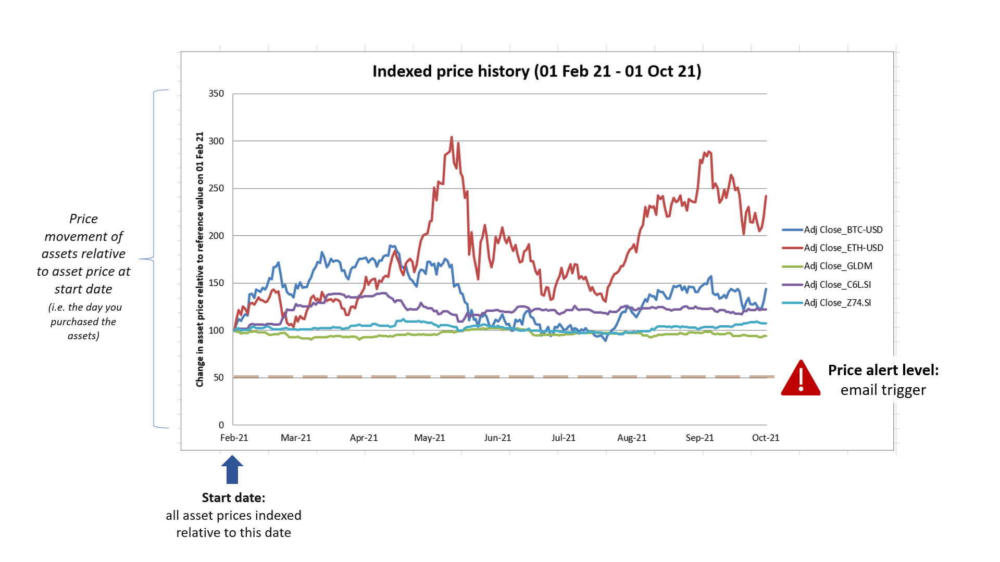

# Your Friendly (mini) Financial bot 

So you've placed some spare cash in some financial assets, but find it a chore to constantly monitor the price data. You have a busy full time job, and you just want an alert to prompt you to review your financial portfolio when the need arises. You don't want to pay hefty financial fees to get someone to monitor those assets for you as you are neither rich nor a big-time investor. You just need something simple like an excel chart to monitor your investments and get the prices indexed to the date that you started investing your money in them. 

Meet **'Your Friendly (mini) Financial bot'**. 

Designed for the value investor, this program can be scheduled to run weekly or fortnightly using Windows Task Scheduler - and prompt the investor to review his/her financial portfolio when the indexed prices fall below a certain price threshold. Best of all, this friendly bot comes without hefty financial fees, and can be customized to the investor's needs.  

## Quick overview:

- Monitor any number of financial assets
- Asset prices are indexed relative to a customizable start date (i.e. the date that you bought those financial assets)
  - *asset prices will be indexed to 100 at the start date*
- if no 'end date' is stated, historical price data from the start date till the current date will be obtained
- Set your own price threshold to trigger email alerts, depending on your own risk appetite
  - *For example, if set at '50', email alerts will be sent when the asset price falls below half the value of the reference price at the start date*

## Background 

Robotic Process Automation, or [RPA](https://en.wikipedia.org/wiki/Robotic_process_automation), is a type of software technology that helps to automate repetitive tasks.  It is useful for any repetitive computer-related task that is based on known rules, and which can be broken down or operationalized into a series of steps. RPA can be helpful to automate repetitive tasks related to the use of legacy software systems that are entrenched within the company culture, and too expensive to change. 

A single tool alone is sometimes insufficient to solve a problem. By combining a [free RPA tool](https://aisingapore.org/tagui/) with other python packages, we can leverage on existing python packages to process excel files, read passwords from Windows Credentials, or send email alerts when a certain specified price threshold is reached. All this can be packaged into a simple program that can be trigged by Windows Task Scheduler at set times -  an unattended RPA bot. 

## Program Features

This repository contains the source code for a simple program that can automate the following:

- Retrieve email password details from Windows Credentials, 
- Read specifications from a `yaml` configuration file,
- Download csv files from [yahoo finance](https://sg.finance.yahoo.com/) that contain the daily price data for a list of financial assets as specified in the configuration file for a specified date range,
- Preprocess the csv files to obtain price data indexed to the price at the start date (index to 100 at start date), 
- Plot the indexed price data for each financial asset in an excel chart,
- Add the indexed and raw price data for each financial asset as separate spreadsheets within the excel file,
- Send an email alert to a specified email address if any of the indexed price data for any financial asset falls below a specified price threshold

For practical reasons, the packaged program is not uploaded onto git. However, the `main.py` file can be packaged into an executable file using `pyinstaller` , which can then be triggered using Windows Task Scheduler - becoming 'Your Friendly (mini) Financial bot' :chart_with_upwards_trend:

## Notebook 

See my [notebook](notebook/Example_rpa_use_case.ipynb) for a simple example on how to use a free tool ([TagUI](https://aisingapore.org/tagui/)) to automate the download of financial asset data.

- The notebook also includes:
  - the initial data exploration of the downloaded csv data for two (2) financial assets, Bitcoin and GLDM (a gold-backed exchange traded fund), 
  - justification for each step of the data processing pipeline detailed in the [`CustomPreprocessor`](src/lib/custom_preprocessor.py) python script.  